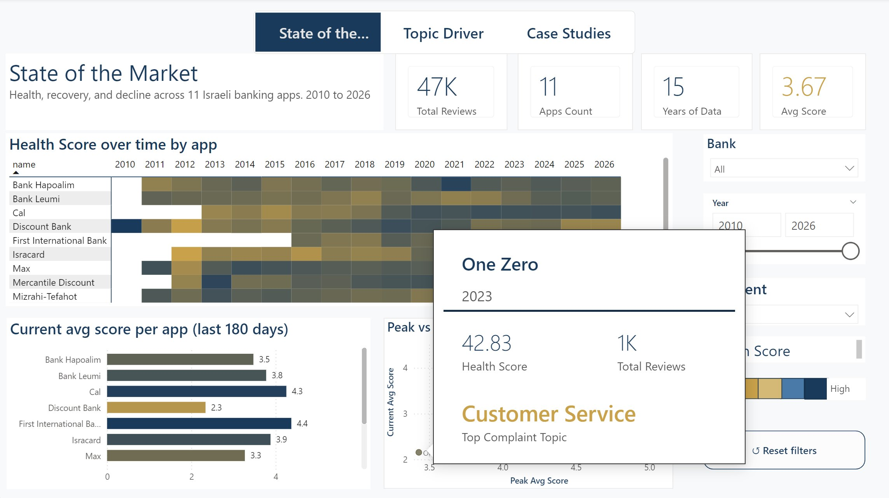
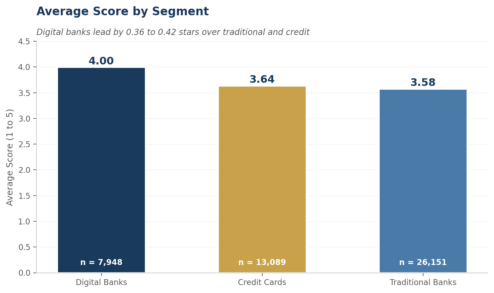
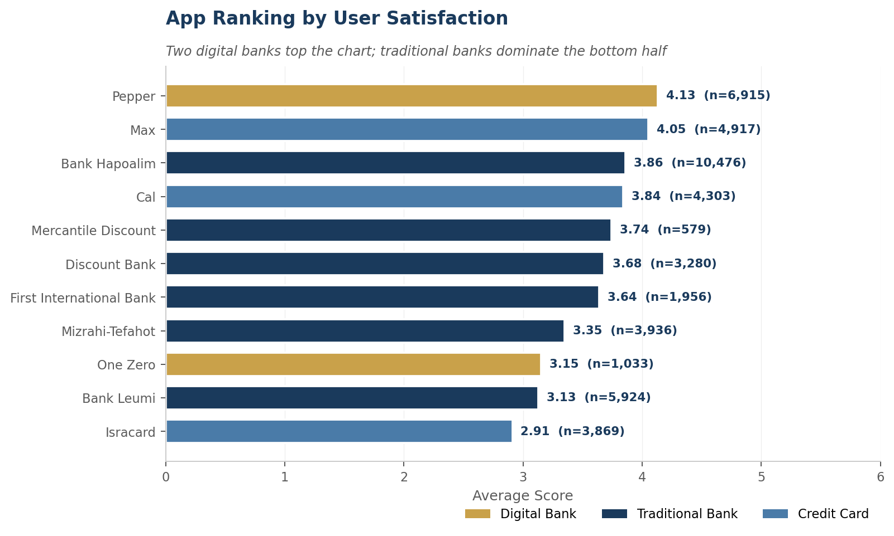
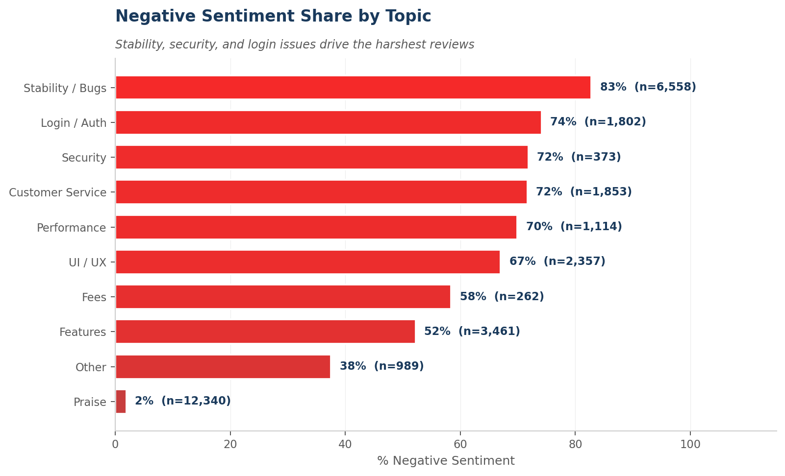
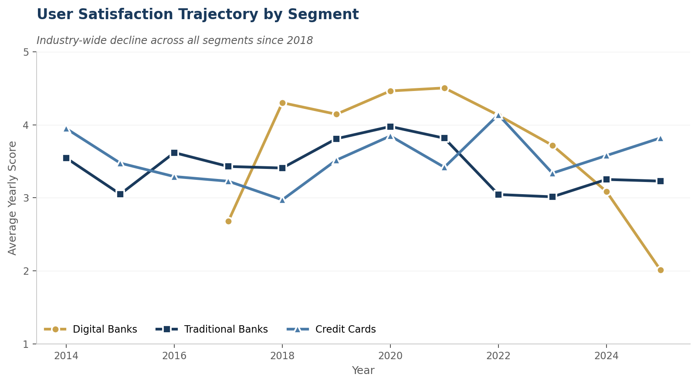
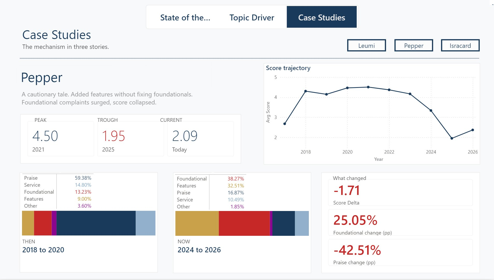
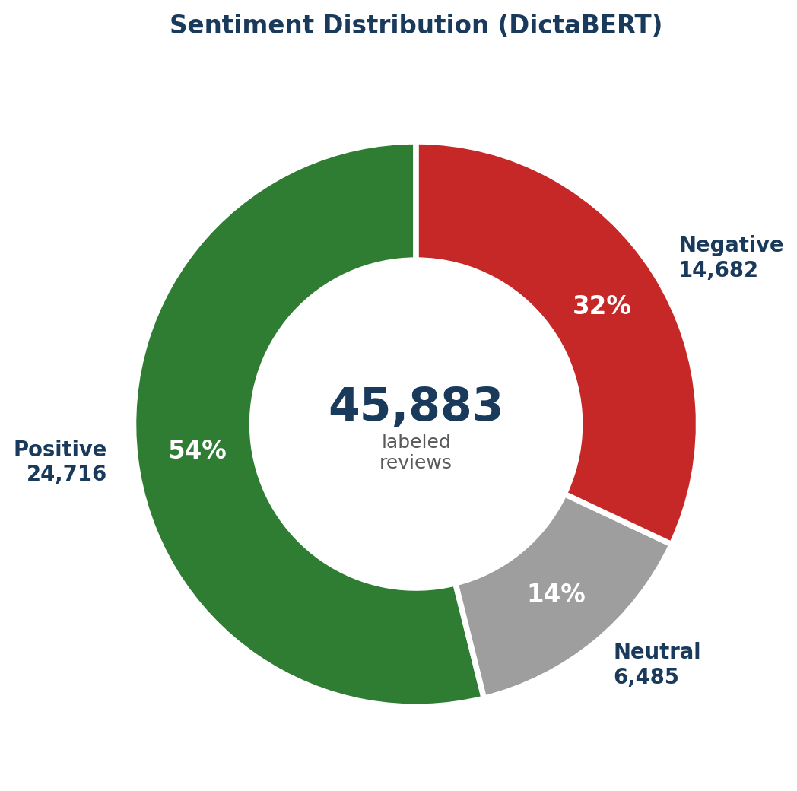
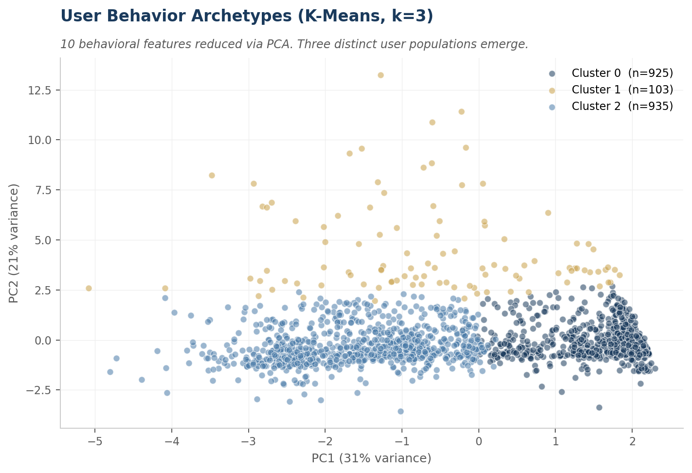
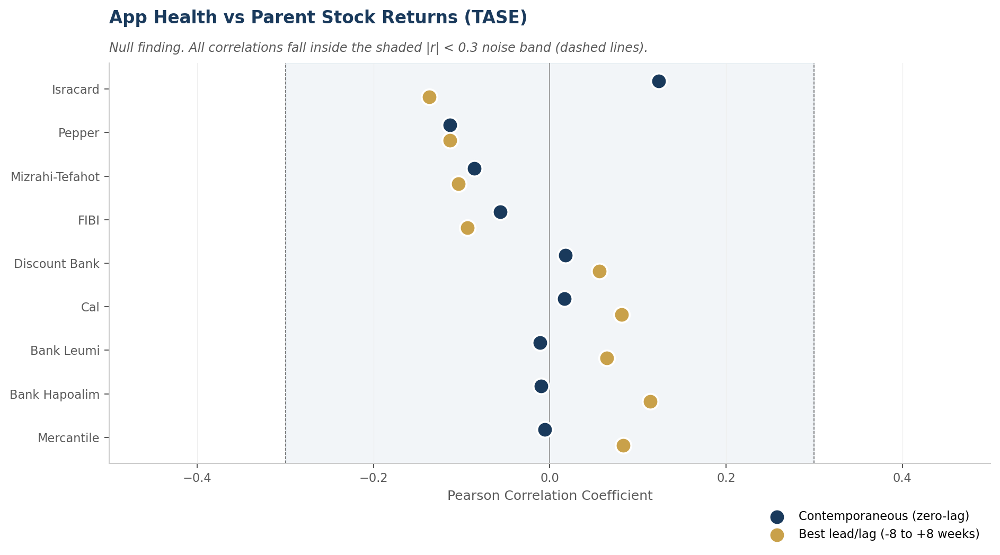
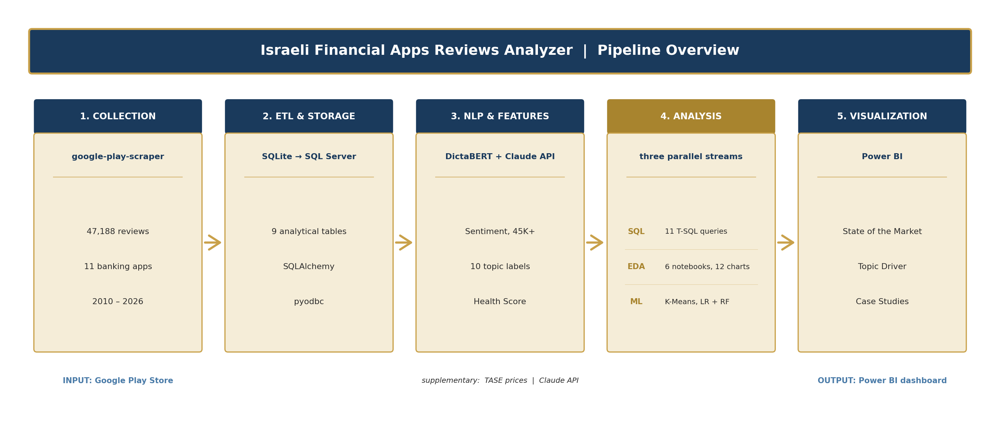

# Israeli Banking Apps: What Drives User Satisfaction?

An end to end analytics project on **47,188 Hebrew Google Play reviews** across
**11 Israeli financial apps** (2010 to 2026). Python and Hebrew NLP feed a SQL
Server warehouse and a three page Power BI dashboard, built to answer one question:
where should a banking product team invest to win on user experience.


## TL;DR

- **Reliability beats features.** The three harshest complaint topics are all
  foundational: Stability (83% negative), Login and Authentication (74%), and
  Security (72%). Feature complaints sit at 52%. Engineering spend on crashes, auth,
  and incident response moves satisfaction more than any new feature.
- **The digital advantage is real but shrinking.** Digital native banks lead the
  market by 0.42 stars, yet Pepper fell from a 4.50 peak in 2021 to 1.95 in 2025,
  the steepest decline in the data.
- **The whole market has declined since 2018.** Every segment has lost ground from
  its peak.
- **Recommendation.** Track Stability and Login complaint shares as product KPIs.
  For digital banks, defend reliability before incumbents close the gap.



The composite **Health Score** used throughout combines average rating, sentiment
balance, momentum, review volume, and developer response rate.

A one page summary is at [docs/Project_Summary.pdf](docs/Project_Summary.pdf).

## The business question

Israeli banks compete on digital experience, but leadership rarely sees a unified,
evidence based view of how their app compares with the market. This project answers
three questions a product, CX, or strategy team needs:

1. **Who is winning?** Which of the 11 apps leads on user experience, and by how much.
2. **Does the digital-native promise hold?** Do Pepper and One Zero really deliver
   better experiences than traditional banks and credit card issuers.
3. **What drives complaints?** Across 10 topic categories, which issues produce the
   harshest reviews and which are noise.

## Key results

### Digital banks lead, but the gap is narrowing

Across 47,188 reviews, digital native banks average 4.00 stars, traditional banks
3.58, and credit card issuers 3.64. The 0.42 star gap is consistent year over year.




### Reliability, not features, drives the harshest reviews

The Claude topic classifier shows a clear pattern. Stability complaints carry 83%
negative sentiment, login and authentication 74%, security 72%. UI and UX sit at
67% and features at 52%. The foundational topics are the actionable levers.



### An industry-wide decline since 2018

Every segment has fallen from its peak. Digital banks dropped from 4.5 in 2021 to
2.0 in 2025, traditional banks from 4.0 to 3.2, credit cards stabilized near 3.4 to
3.8. Each app has a distinct pattern, documented in the SQL case studies.



### Case studies, told in three acts

A narrative dashboard page turns metrics into stories for Leumi, Pepper, and
Isracard. Pepper fell from a 4.50 peak in 2021 to a 1.95 trough in 2025.
Foundational complaints rose 25 percentage points while praise dropped 43.



### Supporting analysis

DictaBERT classifies 54% of reviews as positive, 32% negative, 14% neutral. K-Means
on 10 behavioral features finds three user archetypes: a mainstream cluster, a high
engagement cluster, and a small power user group.




## The bottom line

**Reliability beats features as the lever that matters.** The four harshest topics
are all foundational. For a product or CX team this changes the budget conversation.
Engineering on crash rates, auth reliability, and incident response moves the
satisfaction needle more than any new feature.

**The digital advantage is real but fragile.** Digital banks started from a stronger
base, not from immunity to frustration. Pepper's decline shows the edge erodes
without continuous investment. Incumbents that close the experience gap will compete
on equal footing within three to five years.

**Concrete recommendations.**

- Traditional banks: invest in foundational reliability. Track Stability and Login
  complaint shares as KPIs and run quarterly engineering reviews against them.
- Digital banks: the strategic risk is regression to the mean. Hold the line on
  reliability while incumbents catch up.
- Incident response: the Isracard April 2023 case shows a single failure can drop a
  lifetime average from 3.5 to 2.91. Tie monitoring to review velocity.

## Rigor check: does app health predict the parent stock?

As a bonus test, the pipeline cross references weekly Health Score with daily TASE
prices for the listed parent companies, across lags from -8 to +8 weeks.



**Result: a clean null.** Every correlation falls inside the |r| < 0.3 noise band,
the strongest being Isracard at +0.12. App quality is an operating KPI for
retention, support cost, and brand, not a leading indicator of equity returns at
weekly granularity, where macro factors dominate. The honest negative result is
itself the finding.

## What I built

- **11 T-SQL analytical queries** (`sql/02_analysis.sql`) using CTEs, window
  functions, and conditional aggregation, feeding the dashboard and three case
  studies.
- **A three page Power BI dashboard** with a custom navy and gold theme: State of
  the Market, Topic Driver, and Case Studies.
- **An end to end ETL pipeline** moving 47,188 reviews from Google Play into a nine
  table SQLite warehouse, with migration to Microsoft SQL Server.
- **A Hebrew NLP layer**: DictaBERT sentiment on 45,883 reviews, plus Claude API
  topic labels across 10 categories on 31,109 reviews.
- **scikit-learn models**: K-Means user segmentation and a score change predictor
  benchmarked against baselines.
- **Six Jupyter notebooks** with 12 inline charts telling the story phase by phase.

## A taste of the T-SQL

The Pepper THEN vs NOW panel is driven by a CTE with conditional aggregation and two
window functions for percentage of total within partitions.

```sql
WITH counts AS (
    SELECT
        rt.topic,
        SUM(CASE WHEN YEAR(r.review_date) IN (2020, 2021) THEN 1 ELSE 0 END) AS n_old,
        SUM(CASE WHEN YEAR(r.review_date) IN (2024, 2025) THEN 1 ELSE 0 END) AS n_new
    FROM review_topics rt
    INNER JOIN reviews r ON rt.review_id = r.review_id
    INNER JOIN apps a    ON r.app_id = a.app_id
    WHERE a.name = 'Pepper'
      AND YEAR(r.review_date) IN (2020, 2021, 2024, 2025)
    GROUP BY rt.topic
)
SELECT
    topic, n_old, n_new,
    CAST(n_old * 100.0 / SUM(n_old) OVER () AS DECIMAL(4,1)) AS pct_old,
    CAST(n_new * 100.0 / SUM(n_new) OVER () AS DECIMAL(4,1)) AS pct_new,
    CAST(n_new * 100.0 / SUM(n_new) OVER ()
       - n_old * 100.0 / SUM(n_old) OVER () AS DECIMAL(5,1)) AS pp_change
FROM counts
ORDER BY pp_change DESC;
```

## Apps covered

| Segment | Apps | Reviews |
| --- | --- | --- |
| Traditional banks | Hapoalim, Leumi, Discount, Mizrahi-Tefahot, FIBI, Mercantile | 26,151 |
| Digital banks | Pepper, One Zero | 7,948 |
| Credit cards | Isracard, Cal, Max | 13,089 |

## Pipeline



1. **Collect.** `google-play-scraper`, country IL, language he, resumable runs.
2. **Store.** SQLite working store, migrated to Microsoft SQL Server (`AppReviewsAnalysis`)
   with keys and indexes. Nine tables.
3. **Enrich.** DictaBERT sentiment, Claude topic labels, user level features, the
   composite Health Score, and TASE prices via yfinance.
4. **Analyze.** Three streams: T-SQL queries, Python EDA across six notebooks, and
   scikit-learn models.
5. **Visualize.** The three page Power BI report.

## Tech stack

| Layer | Tools |
| --- | --- |
| SQL and databases | T-SQL on SQL Server (CTEs, window functions), SQLite, SQLAlchemy, pyodbc |
| BI | Power BI Desktop, DAX, drill-throughs, custom theme |
| Python | pandas, numpy, scipy, Jupyter |
| Visualization | matplotlib, seaborn, plotly |
| ML | scikit-learn (K-Means, Logistic Regression, Random Forest) |
| Hebrew NLP | transformers, torch, DictaBERT, Anthropic Claude API |
| Scraping and APIs | google-play-scraper, yfinance |

## Quick start (no pipeline run needed)

The raw data, the enriched SQLite database, and the CSV exports all ship in the repo.

1. **Read the notebooks on GitHub.** They render with charts inline. Start with
   `notebooks/05_advanced_eda.ipynb` for the visual story.
2. **Query the data.** Open `data/processed/reviews.db` in any SQLite client. Nine
   tables are ready to query.
3. **Open the dashboard.** Open `power_bi/Banking_analyst_pbi.pbix` in Power BI
   Desktop, repoint the source to the bundled database or CSVs, and refresh.

## Setup

```bash
git clone https://github.com/taljacob28/app-reviews-analyzer.git
cd app-reviews-analyzer
python -m venv venv
venv\Scripts\activate        # Windows
source venv/bin/activate     # macOS / Linux
pip install -r requirements.txt
```

Copy `.env.example` to `.env` for the optional Claude and SQL Server steps.

## Project structure

```
app-reviews-analyzer/
├── docs/         summary PDF and images
├── notebooks/    six phase-by-phase notebooks
├── src/          modular source (scrapers, database, cleaning, analysis)
├── scripts/      runnable pipeline scripts
├── sql/          T-SQL schema and analysis queries
├── power_bi/     Power BI report and theme
├── data/         raw JSON and the SQLite database
├── exports/      CSV exports
└── requirements.txt
```

## Limitations

- Google Play has no stable user ID. Reviews are grouped by display name, so user
  level analysis treats these as archetypes, not individuals.
- Reviews are self-selected, so the data measures discontent and praise more than
  general satisfaction.
- Sentiment and topic labels carry model error. DictaBERT is around 85% accurate on
  Hebrew benchmarks; topic labels are validated on a held-out sample.

## Contact

**Tal Jacob**, Data Analyst.

- Email: taljacob28@gmail.com
- GitHub: [github.com/taljacob28](https://github.com/taljacob28)
- LinkedIn: [linkedin.com/in/tal-jacob-9753bb256](https://www.linkedin.com/in/tal-jacob-9753bb256)

MIT License.
